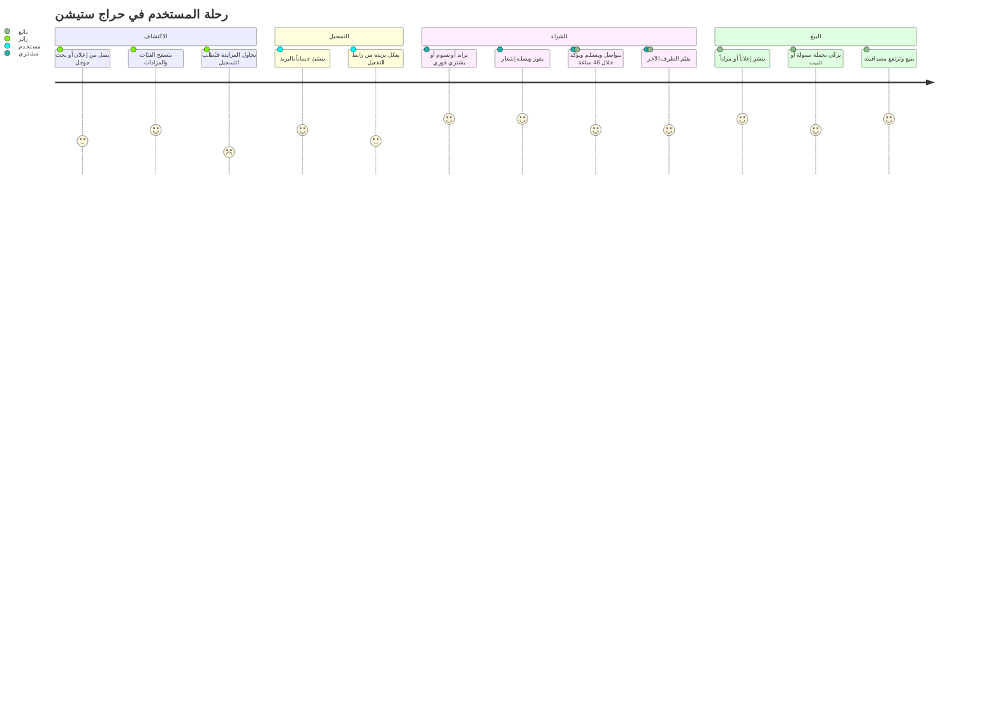
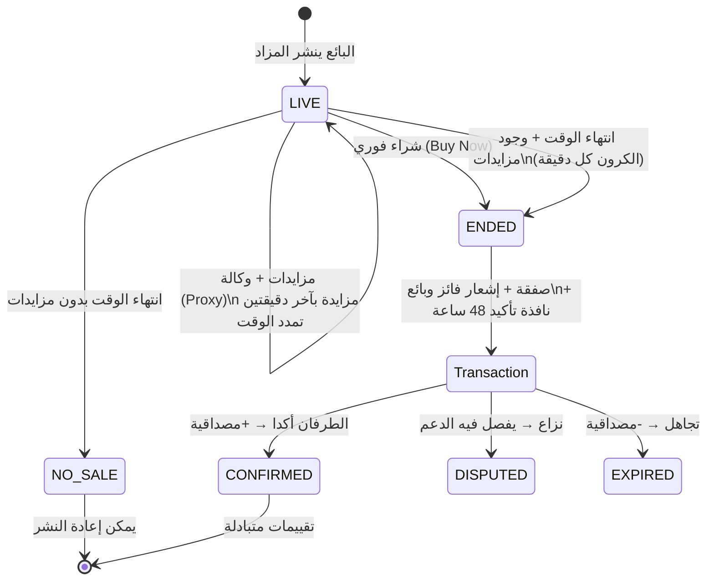
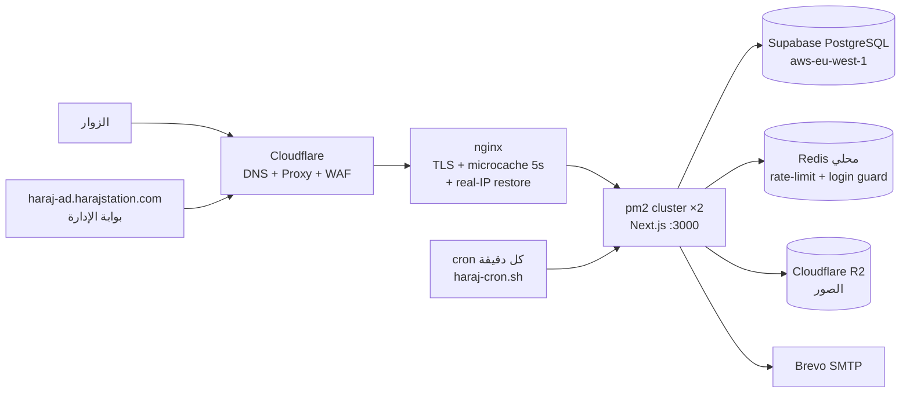

# 📕 حراج ستيشن — الدليل الشامل للمنصة

> **harajstation.com** — سوق سعودي للإعلانات المبوبة والمزادات المباشرة
> آخر تحديث: 2026-07-21 · هذا الملف هو المرجع الكامل: المنصة، السيرفر، رحلة المستخدم، الأمان، والتوسع.

---

## 1. نظرة عامة

منصة عربية (RTL أولاً + ترجمة إنجليزية كاملة) تجمع:

- **إعلانات مبوبة** بفئات رئيسية وفرعية وحقول مخصصة لكل فئة
- **مزادات مباشرة** بمزايدة بالوكالة (Proxy) وحماية من القنص وشراء فوري
- **سوم/عروض** على الإعلانات العادية مع سجل علني
- **نظام مصداقية متبادل** يحاسب البائع والمشتري بعد كل صفقة
- **حملات ممولة بالنقاط** مع استهداف ذكي وإحصائيات للمعلن
- **متاجر موثقة** بهوية بصرية ومتابعين
- **تطبيق موبايل Flutter** يستهلك طبقة `/api/mobile`

| الطبقة | التقنية |
|---|---|
| الواجهة | Next.js 16 (App Router + Proxy/Middleware) · React 19 · TypeScript strict · Tailwind CSS v4 |
| قاعدة البيانات | PostgreSQL على Supabase عبر Prisma 6 + migrations مُلزمة (ممنوع `db push`) |
| الكاش والعدادات | Redis محلي (rate-limit + قفل الدخول) + nginx microcache (5 ثواني للزوار) |
| الصور | Cloudflare R2 (S3 API) — ضغط WebP + فحص magic bytes |
| المدفوعات | Moyasar (فواتير + ضريبة 15% + webhook موقّع) |
| البريد | Brevo SMTP للإرسال · صناديق الدومين على Spacemail (mx1/mx2.spacemail.com) |
| الذكاء الاصطناعي | Anthropic API — وصف الإعلان التلقائي ودليل التسعير |
| التشغيل | Ubuntu VPS · pm2 cluster×2 · nginx · Cloudflare (proxy + DNS) · certbot |

---

## 2. أنواع الحسابات

### حسابات الموقع العام

| النوع | الوصول | ملاحظات |
|---|---|---|
| **زائر** | تصفح كل شيء، بحث، مشاهدة المزادات | لا مزايدة ولا مراسلة ولا إعلانات |
| **مستخدم (USER)** | إعلانات + مزايدة + سوم + محادثات + مفضلة + متجر | تسجيل بالبريد + تفعيل إلزامي، 2FA بالبريد اختياري |
| **مستخدم PRO** | نفس المستخدم + حدود نشر أعلى + شارة مميزة | اشتراك مدفوع أو ممنوح، ينتهي تلقائياً عبر الكرون |
| **متجر موثق** | صفحة متجر ببانر وشعار وشارة توثيق ومتابعين | التوثيق من الأدمن (`/admin/stores`) |

### حسابات بوابة الإدارة (haraj-ad.harajstation.com فقط)

| الدور | الصلاحيات |
|---|---|
| **ADMIN** | كل شيء + إدارة الموظفين + الإعدادات المالية |
| **MODERATOR** | المستخدمون، الإعلانات، المزايدات، البلاغات، التوثيق، الحملات |
| **SUPPORT** | النزاعات، المصداقية، النقاط، البلاغات |
| **ACCOUNTANT** | التقارير المالية فقط |

- الحساب الرئيسي: **admin@harajstation.com**
- حسابات الفريق **لا تستطيع الدخول للموقع العام إطلاقاً**، والعكس: جلسة الموقع لا تفتح البوابة
- إضافة موظف = دعوة بريدية بدون كلمة مرور؛ يدخل برمز ويفعّل كلمة مروره بنفسه من «حسابي»

---

## 3. رحلة المستخدم الكاملة

### 3.1 خارطة الرحلة



### 3.2 دورة حياة المزاد



> ⚠️ **إغلاق المزادات يعتمد كلياً على الكرون** (`/etc/cron.d/harajstation`). لو توقف: الواجهة تعرض «انتهى المزاد» لكن لا فائز ولا إشعارات — راجع قسم الأعطال.

### 3.3 خصوصية المزايدين

- كل مزايد يظهر للعامة **دائماً** بمعرّف مقنّع (حراج_945)
- عند المزايدة يختار: **أسوم باسمي** (الاسم الحقيقي يظهر للبائع فقط + رابط بروفايله) أو **أسوم مجهول** (حتى البائع لا يراه)
- بعد الانتهاء: البائع يرى الفائز حسب اختياره + زر «راسل الفائز» دائماً لترتيب التسليم

### 3.4 البيع داخل المنصة

1. **إعلان بيع عادي** — سعر ثابت، يستقبل سوم/عروض علنية، والبائع يقبل أو يتجاهل
2. **مزاد** — سعر افتتاح + حد أدنى للزيادة + مدة + شراء فوري اختياري + شروط اختيارية
3. **إعلان تعريفي** — بدون بيع (خدمات/وظائف)

أدوات البائع: رفع الإعلان (Bump) مجاناً كل فترة أو بالنقاط · حملة ممولة بالأيام · تثبيت مميز · وصف تلقائي بالذكاء الاصطناعي · دليل تسعير · «تم البيع» لتوثيق صفقة خارج المزاد.

---

## 4. البنية التحتية والسيرفر



**نقاط مهمة:**

- التطبيق في `/var/www/harajstation` ويعمل باسم المستخدم **haraj** (ليس root) على `127.0.0.1:3000`
- `DATABASE_URL` يستخدم **الاتصال المباشر** (:5432) وليس pgbouncer (:6543) — البولر كان يضيف ~100ms لكل استعلام. `connection_limit=12` لأن Supabase يسمح بـ 15 جلسة كحد أقصى (الباقي احتياطي للكرون والسكربتات)
- Cloudflare مفعّل (البرتقالي)؛ nginx يستعيد IP الزائر من `CF-Connecting-IP` لنطاقات كلاودفلير فقط
- شهادات TLS عبر certbot (تجديد تلقائي بـ timer) للدومينين: الرئيسي وبوابة الإدارة

### متغيرات البيئة الأساسية (`/var/www/harajstation/.env`)

`DATABASE_URL` · `DIRECT_URL` · `AUTH_SECRET` · `CRON_SECRET` · `ADMIN_HOST` · `REDIS_URL` · `SMTP_*` + `MAIL_FROM/REPLY_TO` · `R2_*` · `MOYASAR_*` · `VAPID_*` · `ANTHROPIC_API_KEY` · `NEXT_PUBLIC_SITE_URL`

---

## 5. الأوامر التي ستحتاجها على السيرفر

> الدخول: `ssh haraj` (يفتح جلسة root). أوامر التطبيق تُنفذ كـ haraj بـ `sudo -u haraj -H`.

### النشر

```bash
cd /var/www/harajstation && bash deploy/deploy.sh
# = git pull + npm install (عند الحاجة) + prisma migrate deploy + build + pm2 reload (صفر توقف)
```

### pm2 (دائماً كـ haraj — دايمون root لا يملك شيئاً)

```bash
sudo -u haraj -H pm2 status
sudo -u haraj -H pm2 logs harajstation --lines 100
sudo -u haraj -H pm2 reload harajstation      # تحديث بدون توقف
sudo -u haraj -H pm2 restart harajstation     # إعادة تشغيل كاملة
sudo -u haraj -H pm2 monit                    # مراقبة حية
```

### الفحص الصحي والتشخيص

```bash
curl -s http://127.0.0.1:3000/api/health                    # صحة التطبيق من الداخل
curl -s -o /dev/null -w '%{http_code}' https://harajstation.com/
grep "cron.d/harajstation" /var/log/syslog | tail            # هل الكرون يعمل؟ (RELOAD بدون Error)
sudo -u haraj -H pm2 logs harajstation --err --lines 50      # أخطاء التطبيق
systemctl status nginx redis-server
redis-cli ping
```

### قاعدة البيانات

```bash
cd /var/www/harajstation
sudo -u haraj npx prisma migrate status              # حالة الميجريشنز
sudo -u haraj npx prisma migrate deploy              # تطبيق المعلّق (يفعلها deploy.sh تلقائياً)
# نسخة احتياطية يدوية فورية:
sudo -u haraj /var/www/harajstation/deploy/backup.sh
# الاستعادة من نسخة:
gunzip -c /var/backups/harajstation/db-YYYY-MM-DD.sql.gz | psql "$DIRECT_URL"
```

### الكرون والمهام المجدولة

```bash
cat /etc/cron.d/harajstation          # سطران: finalizers كل دقيقة + باك أب أسبوعي
# تشغيل الـ finalizers يدوياً (مزادات/حملات/صفقات/عضويات):
/usr/local/bin/haraj-cron.sh
# ⚠️ بعد أي تعديل على ملف cron.d تحقق فوراً:
grep "cron.d/harajstation" /var/log/syslog | tail -3   # سطر RELOAD يجب ألا يتبعه Error
```

### nginx والشهادات

```bash
nginx -t && systemctl reload nginx
certbot certificates                   # حالة الشهادات
certbot renew --dry-run                # اختبار التجديد
```

### حساب الأدمن والموظفين

```bash
cd /var/www/harajstation
sudo -u haraj node deploy/seed-admin.js
# idempotent: يضمن admin@harajstation.com كأدمن ويسحب ADMIN من أي حساب آخر
# موظف نسي كلمة مروره؟ عطّلها ليدخل برمز البريد ويعيّن واحدة جديدة:
sudo -u haraj node -e "const{PrismaClient}=require('@prisma/client');const db=new PrismaClient();db.user.update({where:{email:'EMAIL_HERE'},data:{passwordEnabled:false}}).then(()=>process.exit(0))"
```

---

## 6. السكربتات

### على السيرفر (`deploy/`)

| السكربت | الوظيفة | يعمل تلقائياً؟ |
|---|---|---|
| `deploy.sh` | النشر الكامل (pull + migrate + build + reload) | يدوي |
| `backup.sh` | pg_dump مضغوط إلى `/var/backups/harajstation` (يحتفظ بأحدث 8) | كل اثنين 03:17 |
| `haraj-cron.sh` (منسوخ إلى `/usr/local/bin/`) | ينادي `/api/cron` بالسر — إغلاق المزادات والحملات والصفقات والعضويات وتنبيهات الأسعار | كل دقيقة |
| `cron.d-harajstation` | الملف الأصلي لـ `/etc/cron.d/harajstation` | — |
| `seed-admin.js` | تثبيت حساب الأدمن الرسمي | يدوي |
| `setup-server.sh` | تجهيز سيرفر جديد من الصفر | يدوي/مرة واحدة |
| `ecosystem.config.cjs` | إعدادات pm2 (cluster×2) | — |
| `nginx/harajstation.conf` + `nginx/haraj-admin.conf` | إعدادات الدومينين | — |

### في المستودع (`scripts/` — تعمل على جهاز التطوير)

| السكربت | الوظيفة |
|---|---|
| `set-password.ts` | تعيين كلمة مرور لحساب من الطرفية (طوارئ) |
| `gen-images.mjs` / `gen-pwa-icons.mjs` | توليد صور العلامة وأيقونات PWA |
| `r2-cleanup.mjs` | حذف صور R2 اليتيمة (غير المرتبطة بإعلانات) |

---

## 7. الأعطال الواردة وحلولها (Troubleshooting)

| العرض | السبب المرجح | الحل |
|---|---|---|
| مزاد «منتهي» في الواجهة لكن لا فائز ولا إشعارات | الكرون واقف — **حصلت فعلياً في 2026-07-18**: سطر خاطئ في cron.d جعل cron يرفض الملف كله بصمت (`Error: bad minute`) | `grep cron.d/harajstation /var/log/syslog` ثم أعد نسخ `deploy/cron.d-harajstation` وتحقق من سطر RELOAD |
| `migrate deploy` يفشل بـ «table already exists» | جداول أنشئت بـ `db push` بدون migration (**حصلت فعلياً** — جداول البروموكود) | `prisma migrate resolve --applied <baseline>` — والقاعدة: ممنوع `db push` نهائياً |
| 526/522 من Cloudflare | شهادة الأصل منتهية أو nginx واقف | `certbot certificates` + `systemctl status nginx` |
| رموز الدخول لا تصل | حصة Brevo، أو حد 5 رسائل/ساعة لكل صندوق، أو صندوق Spacemail غير موجود | راجع لوحة Brevo + تأكد من وجود الصندوق على Spacemail |
| «الباب مقفول حالياً 🔒» عند الدخول | قفل مؤقت بعد 8 محاولات خاطئة (15 دقيقة) | انتظار، أو «نسيت كلمة المرور»، أو تصفير `failedLogins/lockUntil` من قاعدة البيانات |
| 429 «محاولات كثيرة» | حدود الطلبات (90 كتابة/دقيقة، 300 قراءة API/دقيقة لكل IP) | طبيعي ضد الإساءة؛ لو خاطئ تأكد أن nginx يمرر IP حقيقي |
| بطء عام مفاجئ | Redis واقف (يفشل مفتوحاً بدون قفل دخول!) أو ضغط على Supabase | `redis-cli ping` + راجع لوحة Supabase |
| موظف لا يستطيع دخول الموقع العام | **مقصود** — حسابات الفريق للبوابة فقط | ادخل من haraj-ad.harajstation.com |
| صور لا ترفع | حدود R2 أو حجم > 5MB×10 | راجع مفاتيح `R2_*` والحدود في nginx (60m) |
| Payment webhook لا يصل | سر Moyasar تغير أو المسار محجوب | المسار مستثنى من الحدود في `src/proxy.ts` — راجع `MOYASAR_WEBHOOK_SECRET` |

### مشاكل قد تواجه المستخدم النهائي

- **لم يصله رابط التفعيل** → أعد الإرسال من صفحة الدخول (حد 5/ساعة لكل بريد)
- **زايد ولم يظهر اسمه** → هذا التصميم: معرّف مقنّع دائماً للعامة
- **فاز ولا يعرف كيف يتواصل** → صفحة «التحققات» فيها بيانات الطرفين + المحادثات
- **انتهت نافذة الـ 48 ساعة** → الصفقة تُعلَّم منتهية وتخصم مصداقية من المتجاهل
- **نزاع على صفقة** → يفتح نزاعاً بالأدلة ويفصل فيه فريق الدعم

---

## 8. الأمان — النموذج الكامل

### المطبق حالياً

| الطبقة | الحماية |
|---|---|
| الجلسات | JWT HS256 بسر 32+ حرف · كوكي httpOnly/secure/lax · جلسة البوابة منفصلة (`samel_admin`, aud=admin, 12h) |
| الدخول | قفل تصاعدي بعد 8 محاولات · ردود موحدة تمنع تعداد الحسابات (ghost counters) · 2FA بريدي إجباري للفريق واختياري للمستخدمين |
| بوابة الإدارة | دومين منفصل 404 على الموقع العام · noindex · دعوات بدون كلمات مرور · سجل تدقيق لكل دخول وإجراء |
| الطلبات | rate-limit مزدوج (nginx IP حقيقي + Redis لكل مسار) · حماية mail-bombing (5/ساعة، 12/يوم لكل صندوق) |
| المزادات | Serializable transactions ضد السباقات · منع البائع من المزايدة على مزاده (anti-shill) · أسماء مقنعة |
| المحادثات | تشفير عند التخزين AES-256-GCM |
| الرفع | فحص magic bytes · تحويل WebP · حدود حجم وعدد |
| الأسرار | `CRON_SECRET` في الهيدر لا في URL · مقارنات ثابتة الزمن (`safeEqual`) · OTP مخزن كهاش مملّح |
| القاعدة | باك أب أسبوعي + قبل أي عملية خطرة · migrations فقط |

### المخاطر المتبقية (راقبها)

1. **الوصول المباشر للأصل متجاوزاً Cloudflare** — أصل السيرفر يقبل أي IP على 80/443. الأثر محدود (nginx يتجاهل CF-Connecting-IP المزوّر)، لكن الأفضل قصر 80/443 على نطاقات Cloudflare بالجدار الناري
2. **Redis يفشل مفتوحاً** — لو سقط Redis تسقط حدود الطلبات وقفل الدخول معه؛ راقب `systemctl status redis-server`
3. **البوابة بلا «نسيت كلمة المرور»** — متعمد؛ الاستعادة يدوية (`passwordEnabled=false` من السيرفر)
4. **الاعتماد على بريد واحد للأدمن** — من يخترق صندوق admin@ على Spacemail يدخل البوابة؛ فعّل كلمة المرور من «حسابي» ليصبح الدخول عاملين فعليين، وأمّن Spacemail بـ 2FA
5. **shill bidding بحسابات متعددة** — المنع التقني للبائع نفسه فقط؛ الكشف عن التواطؤ يدوي من `/admin/bids`
6. **تحديثات التبعيات** — راجع `npm audit` دورياً؛ Next/Prisma/React كلها حديثة الآن (2026-07)
7. **السحب الآلي (scraping)** — robots + حدود قراءة تكبحه ولا تمنعه؛ لو صار مؤذياً فعّل Cloudflare Bot Fight Mode

---

## 9. خطة التوسع المستقبلية

### قريب (1–2 شهر)
- [ ] إطلاق تطبيق الموبايل (Flutter — موجود في `D:\Claude\Mobile app\haraj_station`) على المتاجر
- [ ] تشغيل حملات Meta بعد نتائج تجربة الـ benchmark (3.62 EGP/زيارة بروفايل)
- [ ] إشعارات SMS (توثيق الجوال موجود في السكيما `phoneVerified` — يحتاج مزود مثل Unifonic)
- [ ] تقارير مالية شهرية تلقائية للأدمن (ACCOUNTANT)

### متوسط (3–6 أشهر)
- [ ] **دفع داخل المنصة/ضمان (Escrow)** — حجز مبلغ الفائز حتى تأكيد الاستلام؛ يرفع الثقة ويفتح عمولة على الصفقات
- [ ] بحث متقدم (فلاتر لحظية + توصيات مبنية على سلوك المستخدم — الإشارات مخزنة أصلاً)
- [ ] ترقية البنية عند النمو: فصل Redis/التطبيق، read-replica للقاعدة، رفع خطة Supabase (سقف الجلسات 15 حالياً هو أول عنق زجاجة متوقع)
- [ ] توثيق هوية إلزامي للمزادات عالية القيمة (نفاذ/أبشر إن أمكن)

### بعيد (6–12 شهر)
- [ ] التوسع الخليجي (الكويت/الإمارات): الأساس جاهز — عملات ومدن لكل دولة
- [ ] مزادات بث مباشر للسيارات والعقارات
- [ ] API عام للمتاجر الكبيرة (رفع مخزون آلي)
- [ ] اشتراكات متاجر بمستويات (عمولة أقل + أدوات أكثر)

---

*هذا الملف يتحدث عن الواقع المنشور فعلياً. عند أي تغيير جوهري (بنية، أمان، تشغيل) حدّثه في نفس الـ commit.*
